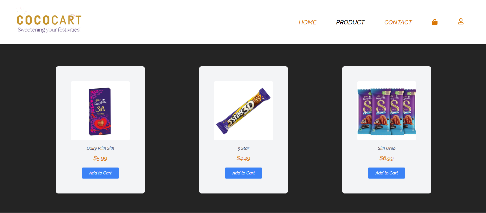

# React + Vite

This template provides a minimal setup to get React working in Vite with HMR and some ESLint rules.

Currently, two official plugins are available:

- [@vitejs/plugin-react](https://github.com/vitejs/vite-plugin-react/blob/main/packages/plugin-react/README.md) uses [Babel](https://babeljs.io/) for Fast Refresh
- [@vitejs/plugin-react-swc](https://github.com/vitejs/vite-plugin-react-swc) uses [SWC](https://swc.rs/) for Fast Refresh

# ChocolateHub Ecommerce

## Overview

ChocolateHub is a dynamic ecommerce website where users can conveniently order a variety of chocolates. The platform offers a seamless shopping experience with features like a user-friendly cart, smart filtering, and secure payment processing.

## Technologies Used

- **Frontend:** HTML, CSS, JavaScript
- **Backend:** Firebase
- **Payment Integration:** Stripe

## How to Run

1. **Clone the repository:** `git clone https://github.com/Roshnnnnn/Toppiffy.git`
2. **Install dependencies:** `npm install`
3. **Set up environment variables**
4. **Run the project:** `npm start`

## Screenshots

## Live Demo

[Explore Chocokart](https://chocokart.netlify.app/)

## Contributing

# Contributing to Toppiffy Ecommerce

Thank you for considering contributing to ChocolateHub! We welcome your help to make this project better.

## Setting up the Development Environment

1. Clone the repository: `git clone https://github.com/Roshnnnnn/Toppiffy.git`
2. Install dependencies: `npm install`

## How to Contribute

1. Fork the repository
2. Create a new branch: `git checkout -b feature/your-feature`
3. Make your changes and commit them: `git commit -m 'Add your feature'`
4. Push to your branch: `git push origin feature/your-feature`
5. Submit a pull request to the `main` branch

## Code Style

Please follow the established code style in the project. Use consistent indentation, naming conventions, and adhere to best practices.

## Submitting a Bug Report

If you find a bug, please open an issue and provide detailed information about the bug, including steps to reproduce.

## Feature Requests

We welcome suggestions for new features. Please open an issue to discuss your ideas.

## Code of Conduct

Please note that this project is released with a [Contributor Code of Conduct](CODE_OF_CONDUCT.md). By participating in this project, you agree to abide by its terms.

## License

By contributing, you agree that your contributions will be licensed under the MIT License. See [LICENSE.md](LICENSE.md) for details.

Happy contributing!

## License

MIT License

---

The MIT License (MIT)

Permission is hereby granted, free of charge, to any person obtaining a copy
of this software and associated documentation files (the "Software"), to deal
in the Software without restriction, including without limitation the rights
to use, copy, modify, merge, publish, distribute, sublicense, and/or sell
copies of the Software, and to permit persons to whom the Software is
furnished to do so, subject to the following conditions:

The above copyright notice and this permission notice shall be included in all
copies or substantial portions of the Software.

THE SOFTWARE IS PROVIDED "AS IS", WITHOUT WARRANTY OF ANY KIND, EXPRESS OR
IMPLIED, INCLUDING BUT NOT LIMITED TO THE WARRANTIES OF MERCHANTABILITY,
FITNESS FOR A PARTICULAR PURPOSE AND NONINFRINGEMENT. IN NO EVENT SHALL THE
AUTHORS OR COPYRIGHT HOLDERS BE LIABLE FOR ANY CLAIM, DAMAGES OR OTHER
LIABILITY, WHETHER IN AN ACTION OF CONTRACT, TORT OR OTHERWISE, ARISING FROM,
OUT OF OR IN CONNECTION WITH THE SOFTWARE OR THE USE OR OTHER DEALINGS IN THE
SOFTWARE.
